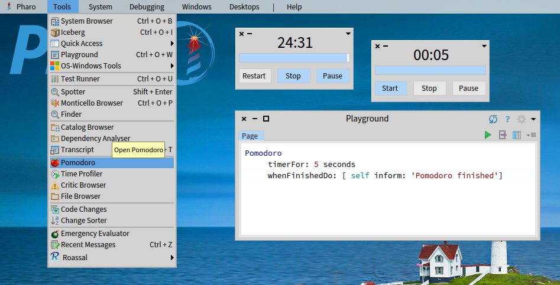

# Pharo-Pomodoro
**Pomodoro Timer** for [Pharo](http://www.pharo.org) following the [Pomodoro Technique](http://en.wikipedia.org/wiki/Pomodoro_Technique)

## About
The Pomodoro Timer for Pharo is written and maintained by T. Bergmann (Astares). It runs as a UI tool within the [Pharo](https://www.pharo.org) environment.

The following people additionally contributed code to this project:
- Phillipe Back (initial experiment [HighOctane-Pomodoro](http://smalltalkhub.com/#!/~philippeback/HOPomodoro), added compatibility to Dark Theme)
- StephanEggermont (taskbar integration, cleanups)

[](https://www.pharo.org) 

[](https://github.com/astares/Pharo-Pomodoro/actions/workflows/build.yml)
[](https://codecov.io/gh/astares/Pharo-Pomodoro)

[](https://pharo.org/download)
[](https://pharo.org/download)
[](https://pharo.org/download)
[](https://pharo.org/download)
[](https://pharo.org/download)

# Quick Start
## Installation via Script

```Smalltalk
Metacello new 
	repository: 'github://astares/Pharo-Pomodoro:main/src';
	baseline: 'Pomodoro';
	load
```

## Screenshot


## Video
[](https://youtu.be/voSUzOu5feU)

## LICENSE
[MIT License](LICENSE)

# Usage

You can also script the timer to use a different duration or 

Open a new 25 minute timer (default duration)
```Smalltalk
Pomodoro new open        
```

Opens a new timer with one minute total time
```Smalltalk
Pomodoro timerFor: 1 minute
```

Provide an action when Pomodoro is finished
```Smalltalk
Pomodoro 
     timerFor: 5 seconds 
     whenFinishedDo: [ self inform: 'Pomodoro finished']
```

# History and Related
- Initial [HOPomodoro experiment from Phillipe on STHub](http://smalltalkhub.com/#!/~philippeback/HOPomodoro)
- Original version starting in Pharo 2.0 - [Post to Pharo mailinglist](https://lists.gforge.inria.fr/pipermail/pharo-project/2013-March/076598.html)
- [Original announcement on Astares blog](https://astares.blogspot.com/2013/03/pomodoro-for-pharo-20.html)
- Initial [repo on SmalltalkHub](http://smalltalkhub.com/#!/~TorstenBergmann/Pomodoro)
- Initial [video on youtube](https://www.youtube.com/watch?v=w00IBi9iM2Y)
- Video from [Stephan on Vimeo](https://vimeo.com/160902072) 
- Updated [video on youtube](https://www.youtube.com/watch?v=voSUzOu5feU)
